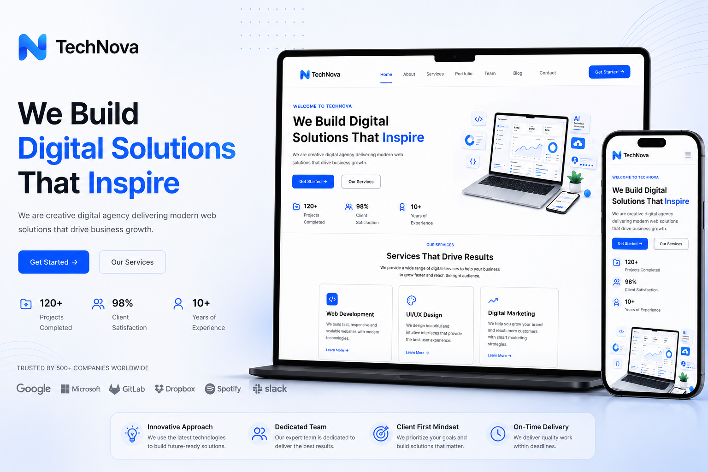

# 🚀 TechNova – Modern Digital Agency Website

TechNova is a modern, responsive multi-page digital agency website built with **React** and **React Router**. The project focuses on clean UI, responsive layouts, reusable components, SEO optimization, and modern frontend development practices.

---

## 🌐 Live Demo

🔗 https://tech-nova-roan.vercel.app

> _(Update this after deployment.)_

---

## 📸 Preview



---

## ✨ Features

- 🎨 Modern & Clean UI Design
- 📱 Fully Responsive Layout
- ⚛️ Built with React
- 🧭 Multi-page Navigation using React Router
- 🔍 SEO Optimized
- ⚡ Optimized Images (WebP)
- 📂 Reusable Components
- 🎯 Lighthouse Optimizations
- 📞 Contact Section
- 📰 Blog Section
- 👨‍💻 Team Section
- 💼 Portfolio Showcase
- 🚀 Fast Build with Vite

---

## 🛠 Tech Stack

- React
- React Router DOM
- Vite
- CSS3
- Lucide React
- HTML5

---

## 📂 Project Structure

```
TechNova/
│
├── public/
│   ├── preview.png
│   ├── robots.txt
│   ├── sitemap.xml
│   └── favicon.svg
│
├── src/
│   ├── assets/
│   ├── Components/
│   ├── Pages/
│   ├── Router/
│   ├── Data/
│   ├── App.jsx
│   └── main.jsx
│
├── package.json
└── vite.config.js
```

---

## ⚙️ Installation

Clone the repository

```bash
git clone https://github.com/yourusername/TechNova.git
```

Go to project directory

```bash
cd TechNova
```

Install dependencies

```bash
npm install
```

Run development server

```bash
npm run dev
```

Create production build

```bash
npm run build
```

---

## 📈 Lighthouse Score

| Category | Score |
|----------|------:|
| 🚀 Performance | 54 |
| ♿ Accessibility | 87 |
| ✅ Best Practices | 100 |
| 🔍 SEO | 100 |

---

## 🎯 Learning Objectives

This project was built while learning:

- React Fundamentals
- Component-Based Architecture
- React Router
- Responsive Design
- SEO Basics
- Image Optimization
- Git & GitHub Workflow
- Project Structure
- Performance Optimization

---

## 📄 License

This project is created for learning and portfolio purposes.

---

## 👨‍💻 Author

**Muhammad Saim**

Frontend Developer | React Developer | UI Enthusiast

GitHub:
https://github.com/yourusername