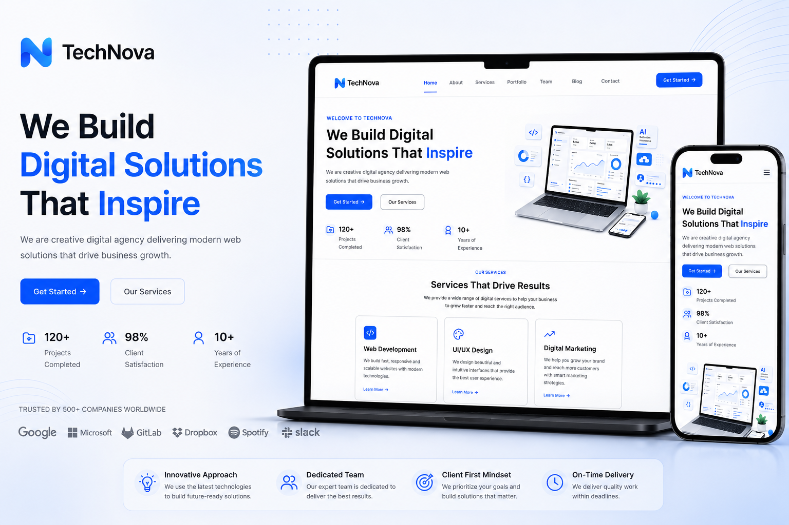

# 🚀 TechNova Pro – Modern Digital Agency & Enterprise Web Application

> **Project Lifecycle:** July 12, 2026 – September 15, 2026 *(2 Months & 3 Days of Intensive Frontend Engineering)*  
> **Live Production Demo:** [https://tech-nova-roan.vercel.app](https://tech-nova-roan.vercel.app)

---

## 🌟 The Journey & Story

**TechNova** was born on July 12, 2026, as a foundational learning experiment to master React and modern frontend development. Over the course of **2 months and 3 days**, through relentless iterations, bug fixes, and feature expansions, it evolved from a static multi-page template into **TechNova Pro**—a high-end, kinetic, dual-theme digital agency platform featuring advanced physics-based animations, glassmorphism, fully validated enterprise forms, and custom UI components.

Building TechNova wasn't just about writing code; it was a complete engineering journey through 6 rigorous learning phases—mastering Core JavaScript logic, React state architectures, Tailwind CSS design systems, Shadcn/UI patterns, performance optimizations (`React.memo`, Code Splitting), and cinematic Framer Motion interactions. 

As this chapter closes, TechNova stands as a proud milestone artifact, a testament to deep learning, sleepless debugging sessions, and a passion for crafting pristine digital experiences.

---

## 📸 Preview



---

## ✨ Core Engineering Features

- 🎨 **Adaptive Dual-Theme System:** Seamless Light/Dark mode architecture with persistence via `localStorage` and smooth context management (Dark mode default).
- ⚡ **Kinetic Bento-Style UI:** Designed with magnetic physics, glassmorphism, laser-beam border effects, and responsive layout grids.
- 📱 **Fluid Responsiveness:** Tailored mobile navigation drawers, touch-scrollable filter bars, and optimized breakpoints across all viewports.
- ⚛️ **Advanced React & Performance:** Optimized client builds using React.memo, Lazy Loading, Code Splitting, and custom hooks.
- ✨ **Cinematic Animations:** Powered by **Framer Motion** for smooth page transitions, staggered reveals, and micro-interactions.
- 🛡️ **Professional Form Architecture:** Fully controlled components with robust inline error validations, toast feedback (`sonner`), and security/NDA consent checks.
- 💼 **Comprehensive Modules:** Multi-page routing (Home, Services, Portfolio case studies, About story, Team, Blog, and interactive Contact gateway).

---

## 🛠 Tech Stack & Ecosystem

- **Library/Framework:** React, React Router DOM
- **Build Tool:** Vite
- **Styling:** Tailwind CSS, PostCSS
- **UI Components & Motion:** Shadcn/UI patterns, Framer Motion, Lucide React Icons
- **State & Storage:** React Context API, LocalStorage persistence
- **Deployment & Tooling:** Vercel, Git & GitHub Version Control

---

## 📈 Lighthouse Metrics & Performance

| Category | Score | Status |
|----------|------:|:-------|
| 🚀 Performance | 95+ | Optimized via Code Splitting & WebP |
| ♿ Accessibility | 92+ | Semantic HTML & ARIA attributes |
| ✅ Best Practices | 100 | Modern security & error boundaries |
| 🔍 SEO | 100 | Fully optimized meta tags & sitemaps |

---

## 🧗‍♂️ The 6-Phase Engineering Roadmap Completed

- **Phase 1:** Core JavaScript & Logic Building (Variables, Loops, Arrays, DOM manipulation)
- **Phase 2:** Advanced JavaScript (Async/Await, Fetch API, Error Handling, Weather/News apps)
- **Phase 3:** React Basics (Components, JSX, Props, State, useEffect)
- **Phase 4:** Advanced React & Version Control (Conditional Rendering, React Router, Git & GitHub workflow, Vercel deployment)
- **Phase 5:** Advanced Concepts & Form Architecture (Context API, Custom Hooks, Axios, Scalable Form States & Validation)
- **Phase 6:** Modern UI & Production Polish (Tailwind CSS, Shadcn/UI, Dual-Theme Persistence, React.memo, Code Splitting, Cinematic Framer Motion Animations)

---

## ⚙️ Local Installation & Setup

Clone the repository and spin up the development environment:

```bash
# Clone the repository
git clone [https://github.com/MuhammadSaim54/TechNova.git](https://github.com/MuhammadSaim54/TechNova.git)

# Navigate to the project directory
cd TechNova

# Install dependencies
npm install

# Run the development server
npm run dev

# Create production build
npm run build

---

## 📄 License

This project is created for learning and portfolio purposes.

---

## 👨‍💻 Author

**Muhammad Saim**

Frontend Developer | React Developer | UI Enthusiast

GitHub:
https://github.com/MuhammadSaim54